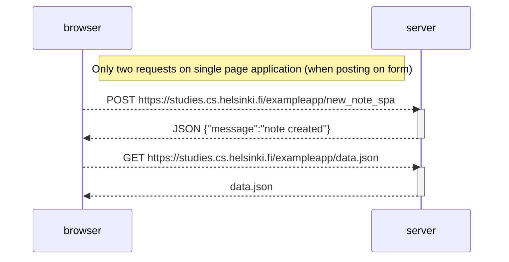

```mermaid
sequenceDiagram
    participant browser
    participant server

    Note right of browser: Only two requests on single page application (when posting on form)
    browser-->>server: POST https://studies.cs.helsinki.fi/exampleapp/new_note_spa
    activate server
    server-->>browser: JSON {"message":"note created"}
    deactivate server

    browser-->>server: GET https://studies.cs.helsinki.fi/exampleapp/data.json
    activate server
    server-->>browser: data.json
    deactivate server
```

